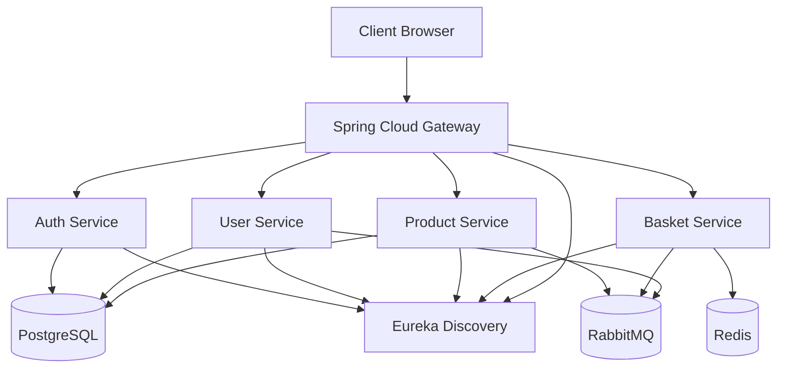

README.md
Cloud Native E-Commerce V3
A modern cloud-native e-commerce platform built with Java 21, Spring Boot, Microservices, Docker, Service Discovery, API Gateway and JWT Authentication.
________________________________________
Project Overview
Cloud Native E-Commerce V3 is a hands-on microservices project developed to explore modern enterprise software architecture.
The project demonstrates:
•   Microservices Architecture
•   Service Discovery
•   API Gateway Pattern
•   JWT Authentication
•   Docker Containerization
•   Event-Driven Architecture Foundations
•   Cloud-Native Design Principles
________________________________________
Architecture

-----------------------------------------
See detailed diagrams:
- [Architecture](diagrams/architecture.md)
- [JWT Flow](diagrams/jwt-flow.md)
- [Eureka Discovery](diagrams/service-discovery.md)
- [Deployment](diagrams/deployment.md)
- [Kubernetes](diagrams/kubernetes.md)
-----------------------------------------
Technology Stack
Backend
•   Java 21
•   Spring Boot 3
•   Spring Data JPA
•   Spring Validation
•   Spring Security
•   Spring Cloud Gateway
•   Spring Cloud Netflix Eureka
Databases
•   PostgreSQL
•   Redis
Messaging
•   RabbitMQ
Infrastructure
•   Docker
•   Docker Compose
•   WSL Ubuntu
•   Nginx
Security
•   JWT Authentication
•   BCrypt Password Encoding
Development Tools
•   IntelliJ IDEA
•   Maven
•   Git
•   GitHub
________________________________________
Microservices
Product Service
Responsibilities:
•   Product CRUD operations
•   Product catalog management
•   PostgreSQL persistence
Port:
9081 (Local)
8081 (Docker)
________________________________________
Basket Service
Responsibilities:
•   Shopping cart operations
•   Redis integration
•   Fast cache access
Port:
9083 (Local)
8083 (Docker)
________________________________________
User Service
Responsibilities:
•   User management
•   Customer information
•   User CRUD operations
Port:
9085 (Local)
8085 (Docker)
________________________________________
Auth Service
Responsibilities:
•   User registration
•   User login
•   JWT token generation
•   Password encryption
Port:
9086 (Local)
8086 (Docker Planned)
________________________________________
Gateway Service
Responsibilities:
•   Single entry point
•   Route forwarding
•   JWT validation
•   Request filtering
Port:
8088
________________________________________
Discovery Service
Responsibilities:
•   Service Registry
•   Service Discovery
•   Dynamic routing support
Port:
9090
________________________________________
Infrastructure Services
PostgreSQL
5432
Redis
6379
RabbitMQ
5672
Management Console:
15672
Adminer
8082
________________________________________
Authentication Flow
Client
  |
  | Login
  v
Auth Service
  |
  | Generate JWT
  v
JWT Token
  |
  | Authorization Header
  v
Gateway Service
  |
  | Validate Token
  v
Microservices
________________________________________
Service Discovery Flow
Product Service
Basket Service
User Service
Auth Service
        |
        v
Eureka Discovery
        |
        v
Gateway Service
________________________________________
Running Locally
Start Infrastructure
docker compose up -d --build
________________________________________
Start Discovery
cd discovery-service
mvn spring-boot:run
________________________________________
Start Gateway
cd gateway-service
mvn spring-boot:run
________________________________________
Start Services
cd product-service
mvn spring-boot:run
cd basket-service
mvn spring-boot:run
cd user-service
mvn spring-boot:run
cd auth-service
mvn spring-boot:run
________________________________________
API Examples
Register User
curl -X POST http://localhost:9086/api/auth/register \
-H "Content-Type: application/json" \
-d '{"username":"user1","password":"123"}'
________________________________________
Login
curl -X POST http://localhost:9086/api/auth/login \
-H "Content-Type: application/json" \
-d '{"username":"user1","password":"123"}'
________________________________________
Access Protected Endpoint
curl \
-H "Authorization: Bearer JWT_TOKEN" \
http://localhost:8088/api/products
________________________________________
Current Features
•   Microservices Architecture
•   Service Discovery
•   API Gateway
•   JWT Authentication
•   Dockerized Infrastructure
•   PostgreSQL Integration
•   Redis Integration
•   RabbitMQ Integration
•   Java 21 Virtual Threads
________________________________________
Planned Features (V4)
•   Role-Based Access Control (RBAC)
•   Refresh Tokens
•   Method Security
•   Distributed Tracing
•   Centralized Configuration
________________________________________
Planned Features (V5)
•   Kubernetes
•   Deployments
•   Services
•   Ingress
•   ConfigMaps
•   Secrets
•   Horizontal Scaling
•   Helm Charts
________________________________________
Author
Cengiz Tansel
GitHub:
https://github.com/cengiztansel
________________________________________
License
Educational and Portfolio Project
________________________________________
